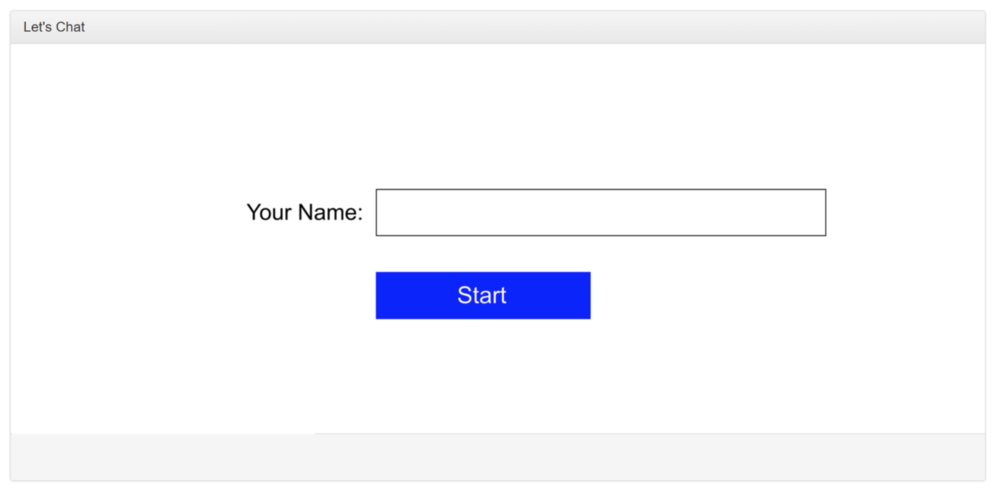
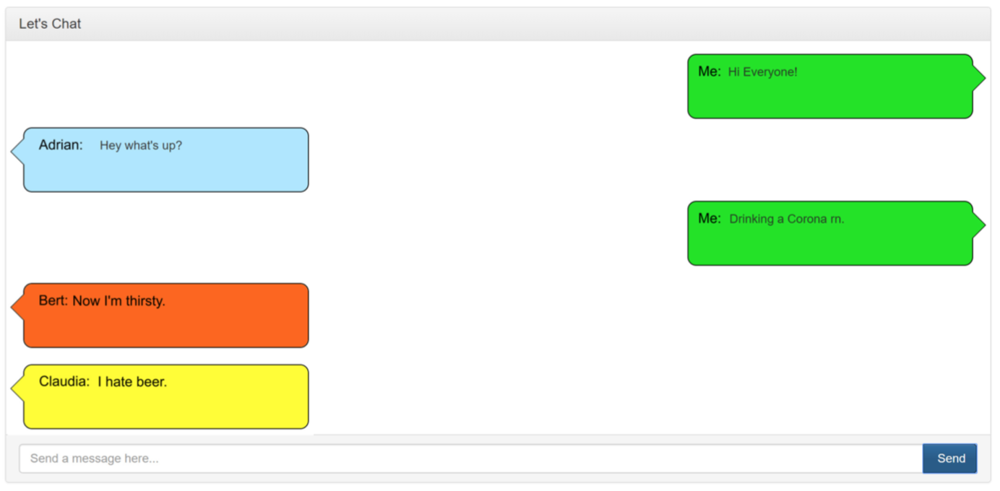

# Description
For this Project I used PHP, MySQL, Ajax, and Jquery. 
 
Team member names: Mauricio Macias, Maria Diaz. 
 

# Short introduction and explanation of each team member's contributions  
Mauricio Macias: Separated css elements to their own css stylesheet and created references to that file within the code. Wrote the index.html interface and color randomization code. Correctly stored username and color into the database. Added color stylesheet changes with div in client.js. This changed the rectangle portion of the message bubble to match the randomized color.  

Maria Diaz: Imported the Ajax chat source code to the school server. Changed username, db, and password to match correct server location. Added username and color columns to database. Changed border-color in css to a css variable and added access to change the variable in div in client.js. This changed the triangle portion of the message bubble to match the randomized color. Created the readme.txt file.  
			
Both parties contributed to trouble shooting, planning, and testing of the database.  

# Wireframe

 
  user enters username before entering the chat room and randomly is selected a color for their chat bubble.
 

 
  Group chat with participants identified by name and color. 
 
# Database Design
 
CREATE TABLE `chatlog` (  
  `id` int(11) NOT NULL,  
  `message` text NOT NULL,  
  `sent_by` varchar(50) NOT NULL,  
  `date_created` int(11) NOT NULL,  
  `username` varchar(50) NOT NULL,  
  `color` varchar(10) NOT NULL  
) ENGINE=InnoDB DEFAULT CHARSET=utf8mb4;  
